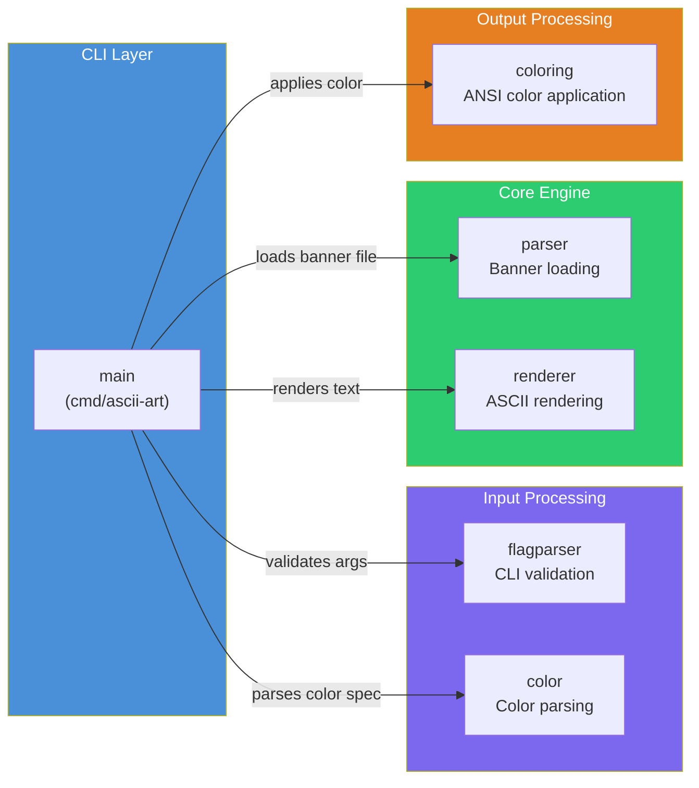

# Architecture Overview

High-level view of the system architecture. Packages are grouped by responsibility layer.

## Package Responsibilities

| Layer | Package | Responsibility |
|-------|---------|---------------|
| CLI | `main` | Orchestrates all packages, handles I/O |
| Input | `flagparser` | Validates CLI argument structure |
| Input | `color` | Parses color specs (named, hex, RGB) into RGB values |
| Core | `parser` | Reads banner files, builds character maps |
| Core | `renderer` | Converts text to ASCII art using banner maps |
| Output | `coloring` | Applies ANSI color codes to rendered ASCII art |

## Key Design Decisions

- **Zero inter-package dependencies** — all packages depend only on the Go standard library
- **Main as orchestrator** — `main` is the only package that imports other project packages
- **Stateless packages** — all functions are pure transformations (no global state, no side effects except file I/O in parser)
