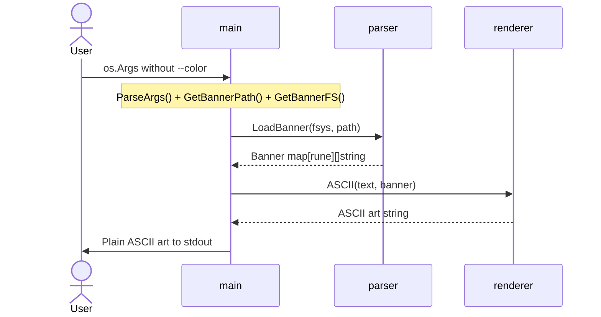

# Sequence Diagram

Call sequence for **color mode** — the more complex execution path. Shows how `main` orchestrates all packages over time.

```mermaid
sequenceDiagram
    actor User
    participant main
    participant flagparser
    participant color
    participant parser
    participant renderer
    participant coloring

    User->>main: os.Args with --color flag

    Note over main: hasColorFlag() = true

    main->>flagparser: ParseArgs(args)
    flagparser-->>main: nil (valid)

    Note over main: extractColorArgs()

    main->>color: Parse(colorSpec)
    color-->>main: RGB{R, G, B}

    main->>main: GetBannerPath(banner)
    main->>main: GetBannerFS()

    main->>parser: LoadBanner(fsys, path)
    parser-->>main: Banner map[rune][]string

    main->>color: ANSI(rgb)
    color-->>main: "\033[38;2;R;G;Bm"

    loop For each line in text
        main->>renderer: ASCII(line, banner)
        renderer-->>main: string (ASCII art with \n)

        main->>main: split rendered ASCII into artLines

        main->>parser: CharWidths(line, banner)
        parser-->>main: []int (character widths)

        main->>coloring: ApplyColor(artLines, line, substring, colorCode, widths)

        Note over coloring: findPositions(line, substring)<br/>colorLine() for each art line

        coloring-->>main: []string (colored lines)
    end

    main->>User: Colored ASCII art to stdout
```

## Normal Mode (simplified)

For comparison, normal mode has a much shorter sequence:


