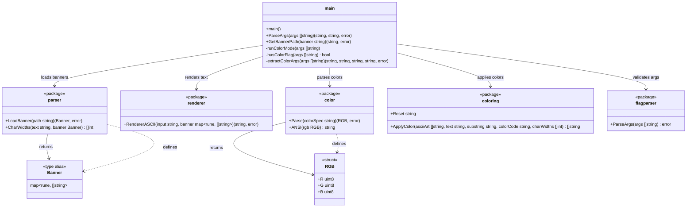

# Class Diagram

Package relationships, exported types, and function signatures. All internal packages are independent — only `main` imports them.

## Dependency Rules

- `main` depends on all five internal packages
- No internal package imports another internal package
- All packages depend only on the Go standard library
- This ensures packages can be tested, reused, and maintained independently
