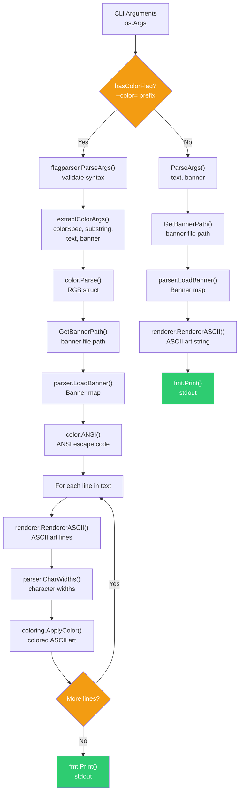

# Program Flowchart

Execution flow from CLI input to ASCII art output. The program has two modes: **Normal** (text only) and **Color** (with ANSI coloring).

## Mode Comparison

| Aspect | Normal Mode | Color Mode |
|--------|------------|------------|
| Validation | `ParseArgs()` | `flagparser.ParseArgs()` |
| Color parsing | — | `color.Parse()` → `color.ANSI()` |
| Rendering | Single call | Per-line loop |
| Post-processing | — | `CharWidths()` + `ApplyColor()` |
